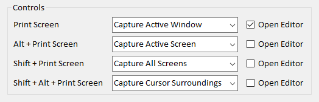
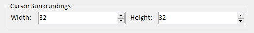
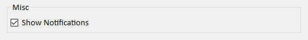

# Screen Catch

A small utility app that automatically saves screenshots.

Unlike most similar apps I found, this one can instantly save
screenhots without opening them in any kind of editor.

Images are saved into a directory called **ScreenCatch** that is
created inside user's Pictures directory (typically "C:\Users\UserName\Pictures\ScreenCatch").

After a screenshot is saved a notification will be shown.
Clicking on the notification will open the directory with the last image selected.

The app runs in the system tray, right clicking it's icon will show the following options:

Option | Meaning
------ | -------
Open Directory | opens directory with captured images
Show Notifications | enables/disables notifications
Open Settings | shows application settings
Exit | terminates the application

### Application settings

#### Controls

Which action should be taken when a keyboard shortcut is pressed, possible actions are: 

Action | Meaning
------ | -------
Capture Active Window | captures active window
Capture Active Screen | captures screen with active window
Capture All Screens | captures all screens
Capture Cursor Surroundings | captures area around mouse cursor
Do Nothing | deactivates the shortcut

If **Open Editor** is enabled, captured screenshot will be opened in the default image editor.

#### Cursor Surroundings

Area width and height for "Capture Cursor Surroundings" action,
both can be set to values between 1 and 512.

#### Misc

Option | Meaning
------ | -------
Show Notifications | whether notifications should be shown

### Notes

- the app only runs on Windows
- on Windows 10, most windows will be captured with an extra border around them, this is because Windows 10 incorrectly reports window sizes

